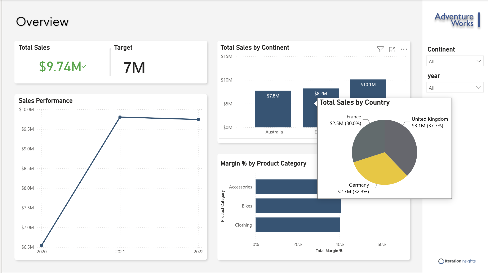
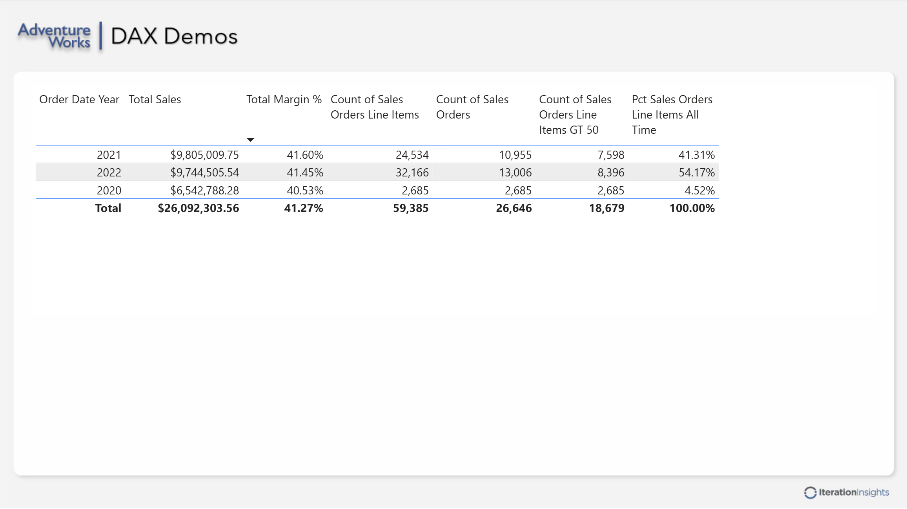
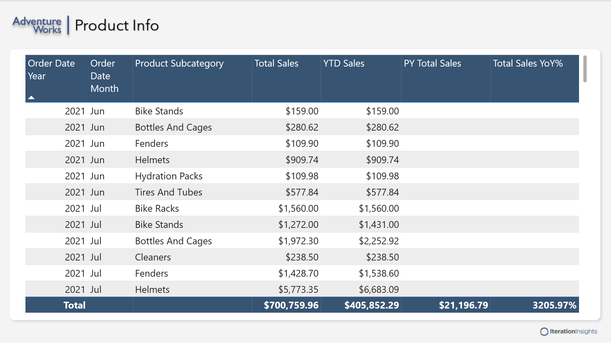
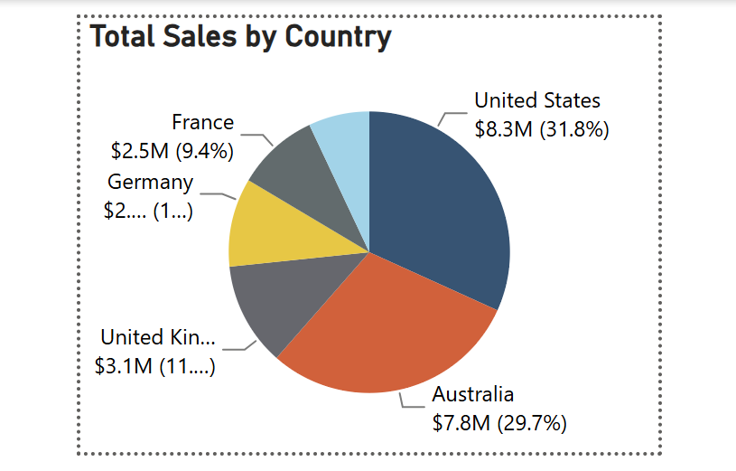

# Power BI Sales Dashboard

## Project Overview

This project is a Power BI sales analysis dashboard created as part of my Power BI learning and practice. The goal of this project is to demonstrate the full Power BI workflow, including data preparation, data modeling, DAX measures, report design, and interactive business intelligence visualizations.

The dashboard provides a high-level overview of sales performance, target comparison, sales by continent, product-level sales details, DAX measure practice, and sales breakdown by country.

## Dashboard Preview

### Sales Overview Dashboard



### DAX Measures Demo



### Product Sales Analysis



### Sales by Country Breakdown



## Key Features

- Created an interactive Power BI report with multiple pages
- Built a sales overview dashboard with KPIs and trend analysis
- Used slicers to filter data by continent and year
- Created visuals for sales performance, sales by continent, sales by country, and margin percentage by product category
- Applied DAX measures for key business metrics
- Practiced time intelligence measures such as year-to-date sales, previous year sales, and year-over-year percentage
- Designed a clean report layout for business users

## Tools Used

- Power BI Desktop
- Power Query
- DAX
- Data modeling
- GitHub

## Main Report Pages

### Overview

The Overview page provides a high-level sales dashboard with total sales, target comparison, sales performance by year, total sales by continent, margin percentage by product category, and slicers for continent and year.

### DAX Demos

The DAX Demos page demonstrates DAX measures such as total sales, total margin percentage, count of sales orders, count of sales order line items, and percentage of sales order line items over time.

### Product Info

The Product Info page shows product-level sales details, including total sales, year-to-date sales, previous year total sales, and year-over-year sales percentage.

### Sales by Country

The Sales by Country visual breaks down total sales by country and shows each country’s contribution as both sales value and percentage of total sales.

## Skills Demonstrated

- Importing and transforming data in Power Query
- Cleaning and preparing data for reporting
- Building relationships between tables
- Creating DAX measures
- Working with time intelligence calculations
- Designing interactive visuals
- Using slicers and filters
- Creating business-focused dashboards
- Organizing a Power BI report for decision-making
- Presenting insights through a clear dashboard layout

## Example Business Questions Answered

This report helps answer questions such as:

- What are the total sales?
- Did sales meet or exceed the target?
- How did sales perform across different years?
- Which continent generated the highest sales?
- Which countries contributed most to total sales?
- Which product category had the highest margin percentage?
- How do year-to-date sales compare with previous year sales?
- How can users filter the report by year and continent?

## Key Insights

- Total sales reached approximately $9.74M.
- Sales exceeded the target of $7M.
- North America had the highest total sales compared with Europe and Australia.
- Sales increased strongly from 2020 to 2021 and remained high in 2022.
- Accessories had the highest margin percentage among the product categories shown.
- The country-level breakdown shows how total sales are distributed across different markets.

## Files in This Repository

```text
Sales.pbix
README.md
screenshots/
